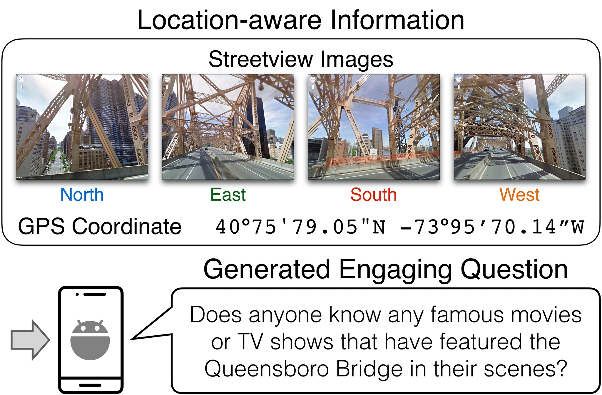
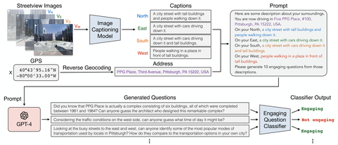

# Location-Aware Visual Question Generation with Lightweight Models

This is an official repository of [**Location-aware Visual Question Generation with Lightweight Models**](https://arxiv.org/abs/2310.15129), which is published in [EMNLP 2023](https://2023.emnlp.org/). We provide the dataset and the implementation of our proposed model.

This project aims to develop lightweight models that can generate engaging questions from data relevant to a particular geographical location. Specifically, we represent such location-aware information with surrounding images and a GPS coordinate. 

<p align="center">
    
</p>

To tackle this task, we present a dataset generation pipeline that leverages GPT-4 to produce diverse and sophisticated questions.

<p align="center">
    
</p>
We propose a method, Filtered Distilled T5-Tiny (FDT5), which can reliably generate engaging questions from location-aware information. Our proposed method outperforms baselines regarding human evaluation (e.g., engagement, grounding, coherence) and automatic evaluation metrics (e.g., BERTScore, ROUGE-2). Moreover

## Dataset Structure
The dataset was collected using the procedure described in the [paper](https://arxiv.org/abs/2310.15129).  The sample prompt to query to GPT-4 using own API Key is also provided.

We split the dataset into train, val, and test set. Each set is formed as a json file with the structure shown below.

```
{
  [Location / Image ID] : {
    "Caption": [ ... ],
    "Question": [ ... ]
    }
}
```

Each Image ID corresponds to the IDS in [Google Street view Dataset](https://www.crcv.ucf.edu/data/GMCP_Geolocalization/). This data is collected in order to train smaller language model: T5, VL-T5 that are used in [MVQG](https://arxiv.org/abs/2211.07441).

For each image id, we provide the captions and questions corresponding to the iamge id. The first four entry to the caption is the captions of the street view images from four directions, the last entry of the caption is from the street address of the location. The questions are collected and filtered from GPT-4. we select top-5 questions from 10 questions that are generated.

We also provided the raw questions in the directory

## Model
We also provide our engaging classifier and FDT5 codes. We did not provide the checkpoint, so you will need to train it to test it. Provided below is the steps to train the models.

### Engaging Question Classifier
To train the engaging question classifier, go to the EngagingClassifier Folder in the directory

```
cd Models/EngagingClassifier
```

Afterwards, enter this line of code to train the classifier:
```
python3 train.py
```

It will result in a model that will be saved as ".pkl" file in the same directory. You can try inferencing using this line of code:
```
python3 test.py
```

### T5 Model
To train the T5 model, go to the T5 folder in the Models directory
```
cd Models/T5
```

Enter this line of code to train the T5 model:
```
sh train_t5.sh
```

Afterwards you will have a checkpoint folder created in the directory, and you can find your model checkpoints there. Use this line of code to try inference:
```
sh inference_t5.sh
```

### FDT5 Model
To train the FDT5 model, go to the T5 folder in the Models directory
```
cd Models/T5
```

Enter this line of code to train the FDT5 model, we would need to have T5 Large as the teacher for the distillation process first, therefore we are going to train T5 Large model first:
```
sh train_t5large.sh
sh train_fdt5.sh
```

Afterwards you will have a checkpoint folder created in the directory, and you can find your model checkpoints there. Use this line of code to try inference:
```
sh inference_fdt5.sh
```

## Cite this Paper
If you find this paper useful, you can cite:
```
@inproceedings{suwono2023location, 
  title={Location-Aware Visual Question Generation with Lightweight Models}, 
  author={Nicholas Collin Suwono and Justin Chen and Tun Min Hung and Ting-Hao Kenneth Huang and I-Bin Liao and Yung-Hui Li and Lun-Wei Ku and Shao-Hua Sun}, 
  booktitle = {Empirical Methods in Natural Language Processing}, 
  year={2023} 
}
```

## References
- Amir Roshan Zamir and Mubarak Shah "[Image Geo-localization Based on Multiple Nearest Neighbor Feature Matching using Generalized Graphs](https://vilab.epfl.ch/zamir/index_files/PAMI_Amir%20Zamir.pdf)" in IEEE Transactions on Pattern Analysis and Machine Intelligence (TPAMI).
- Min-Hsuan Yeh, Vicent Chen, Ting-Hao 'Kenneth' Haung, and Lun-Wei Ku "[Multi-VQG: Generating Engaging Questions for Multiple Images](https://arxiv.org/abs/2211.07441)" in Empirical Methods in Natural Language Processing 2022
